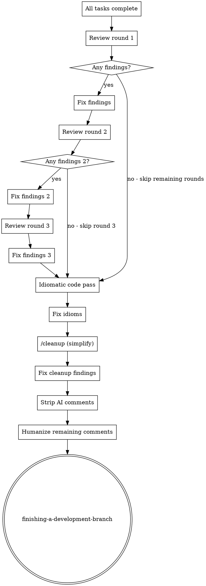

# Post-Implementation Polish

Six-phase pipeline that runs after all implementation tasks complete and their per-task reviews pass. Replaces the single final code review in subagent-driven-development and executing-plans.

**Auto-invoked by:** subagent-driven-development (after all tasks), executing-plans (after all tasks)

**Announce at start:** "Running post-implementation polish - 6 phases before finishing the branch."

## When This Runs

```
[all implementation tasks complete with per-task reviews passed]
        |
        v
  post-implementation-polish (this skill)
        |
        v
  finishing-a-development-branch
```

This skill sits between task completion and branch finishing. The execution skills (subagent-driven-development, executing-plans) invoke it automatically.

## The Six Phases

### Phase 1-3: Three Rounds of Code Review

Each round dispatches a `superpowers:code-reviewer` subagent against the full diff from base branch, then fixes all findings before proceeding to the next round.

**Why three rounds:** Each fix round can introduce new issues or reveal problems masked by earlier ones. Diminishing returns after three.

For each round (1, 2, 3):

1. Get the diff scope:
   ```bash
   BASE_SHA=$(git merge-base HEAD main 2>/dev/null || git merge-base HEAD master 2>/dev/null)
   HEAD_SHA=$(git rev-parse HEAD)
   ```

2. Dispatch `superpowers:code-reviewer` subagent using the template at `requesting-code-review/code-reviewer.md`:
   - `WHAT_WAS_IMPLEMENTED`: Full feature description from the plan
   - `PLAN_OR_REQUIREMENTS`: Path to the spec/plan document
   - `BASE_SHA`: From step 1
   - `HEAD_SHA`: From step 1
   - `DESCRIPTION`: "Post-implementation review round N/3"

3. Act on findings:
   - **Critical/Important**: Fix immediately
   - **Minor**: Fix if straightforward, skip if trivial
   - Commit fixes

4. If round produced zero findings, skip remaining rounds (code is clean).

### Phase 4: Idiomatic Code Pass

Dispatch a subagent specifically focused on language idioms. The subagent:

1. Reads the full diff (`git diff $BASE_SHA...HEAD`)
2. For each file, identifies the language and checks:
   - Are language-specific idioms used? (e.g., `lib.mkIf` over `if/then` in Nix, `vim.keymap.set` over `nvim_set_keymap` in Lua)
   - Do patterns match what the codebase already does?
   - Are there verbose constructions that have idiomatic alternatives?
3. Fixes non-idiomatic code directly
4. Commits fixes

**Subagent prompt template:**

```
You are reviewing code for idiomatic patterns. Read the project's CLAUDE.md
and any language-specific rule files first to understand conventions.

Diff to review: git diff {BASE_SHA}...HEAD

For each changed file:
1. Identify the language
2. Read surrounding code in the same module for existing patterns
3. Replace non-idiomatic constructions with idiomatic alternatives
4. Do NOT change working logic - only improve how it's expressed

Focus areas:
- Language-specific idioms (the project's CLAUDE.md lists many)
- Codebase-local conventions (match what's already there)
- Standard library usage over hand-rolled equivalents
- Naming consistency with the rest of the codebase

Fix issues directly. Commit with message: "polish: use idiomatic patterns"

Report what you changed and why.
```

### Phase 5: Cleanup Pass

Invoke the `/cleanup` skill (simplify). This launches three parallel review agents (reuse, quality, efficiency) and fixes findings.

After `/cleanup` completes and fixes are applied, commit any changes.

### Phase 6: Strip AI Comments and Humanize

Two-step phase:

**Step 1: Strip unnecessary comments**

Dispatch a subagent to scan all changed files (`git diff $BASE_SHA...HEAD --name-only`) and remove:

- Comments that restate what the code does ("increment counter", "return the result")
- AI-generated artifacts ("Here's the implementation", "This handles the case where...")
- Obvious doc comments on self-documenting code
- TODO/FIXME comments that reference completed work
- Section dividers or decorative comments

**Keep** comments that explain:
- Non-obvious "why" (hidden constraints, workarounds, subtle invariants)
- External references (links to issues, RFCs, specs)
- Warnings about gotchas that aren't obvious from the code

Commit removals: "polish: strip unnecessary comments"

**Step 2: Humanize remaining comments**

For any comments that survived step 1, run the humanizer skill patterns on them:
- Remove AI vocabulary ("crucial", "enhance", "leverage", "utilize")
- Remove hedging ("it should be noted that", "it is important to")
- Remove sycophantic tone
- Use natural, direct language
- Keep technical accuracy

This is a targeted pass - only touch comment text, never code. Commit: "polish: humanize comments"

## Process Flow



## Red Flags

**Never:**
- Skip phases (run all 6 in order)
- Fix code logic during comment stripping (phase 6 is comments only)
- Add new features or behavior during polish
- Humanize code - only humanize comment text
- Run phases in parallel (each builds on the previous)

**Early exit:**
- If review rounds 1-3 find zero issues, skip remaining rounds
- If phase 6 finds no comments to strip/humanize, just note "no comment changes needed"

## Integration

**Called by:**
- `subagent-driven-development` - after all tasks pass per-task reviews
- `executing-plans` - after all tasks complete

**Calls:**
- `superpowers:requesting-code-review` - for review rounds 1-3
- `/cleanup` (simplify skill) - for phase 5
- humanizer patterns - for phase 6 comment humanization

**Followed by:**
- `superpowers:finishing-a-development-branch`
