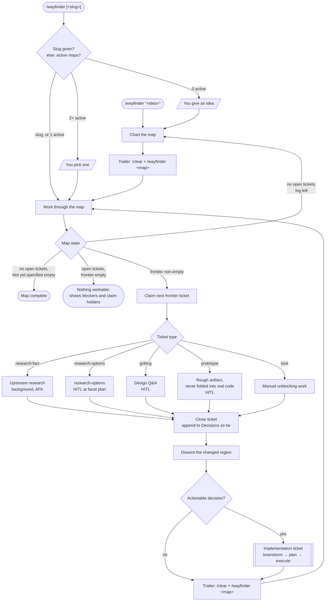
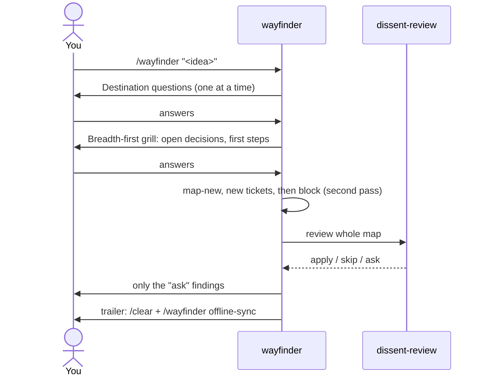
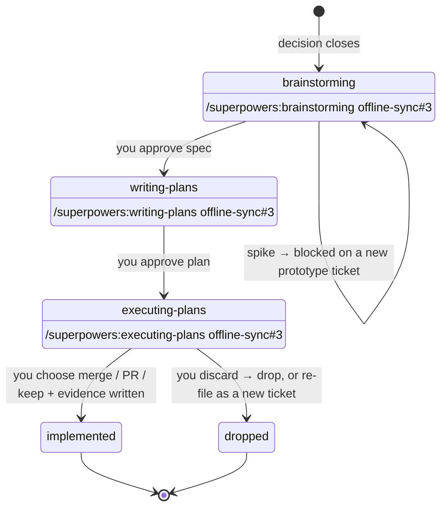
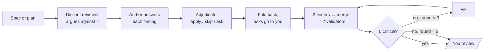
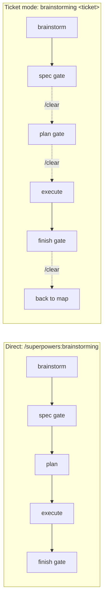
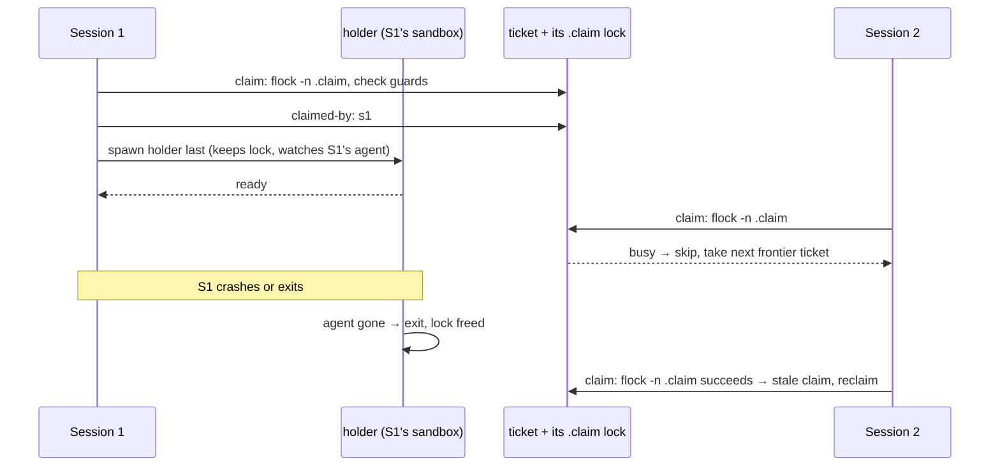

# AI workflow: wayfinder + superpowers

> **Status: design, not yet implemented.** This describes the planned merge of
> [zvolin's wayfinder-driven flow](https://github.com/zvolin/nixos-config/tree/main/patches)
> with the superpowers customizations (today one `patches/superpowers-customizations.patch`; this
> work splits it into per-skill patches under `patches/superpowers/`).
> Implementation design: [docs/specs/2026-10-01-wayfinder-merge-design.md](specs/2026-10-01-wayfinder-merge-design.md).

Two layers. **Wayfinder** (vendored from [mattpocock/skills](https://github.com/mattpocock/skills))
handles efforts too big for one session: it charts a map of open decisions and resolves them one
ticket per session. **Superpowers** (brainstorming → writing-plans → executing-plans) turns each
actionable decision into code. Wayfinder drives; superpowers does the building.

Calling a superpowers skill directly, without a ticket, keeps working as before with three
deliberate changes: the new [review gate](#review-gate-specs-and-plans), the "Asking the user" rules
(each question restates its context, gives 2-3 options with costs and a recommendation), and
`subagent-driven-development` picking up the ticket named in a plan's handoff block when it is run
on such a plan directly.

## The big picture



## Vocabulary

| Term | Meaning |
|---|---|
| **Map** | One effort: a destination, a "Decisions so far" log, and a "Not yet specified" section for things too foggy to ticket yet |
| **Ticket** | One question sized to a single session. Has a type, `blocked-by` edges, and a claim |
| **Frontier** | Open, unblocked tickets that are unclaimed or whose claim went stale, plus your own session's claimed tickets (listed first): what can be worked right now |
| **Reference** | How maps and tickets are named everywhere: `offline-sync` for a map, `offline-sync#3` for a ticket |
| **Claim** | A session marks a ticket as its own before starting, so parallel sessions skip it |
| **Trailer** | A fenced block at the end of a session with the exact `/clear` + next command to paste |
| **Dissent** | Adversarial review: a cold reviewer argues against the artifact, the author answers, a neutral adjudicator rules apply / skip / ask |

## Where you are in the loop (HITL)

🧑 = waits for you. ⚙ = runs on its own.

### One-time setup per project

| Command | What it does |
|---|---|
| `/setup-matt-pocock-skills` | 🧑 pick the tracker: local markdown, GitHub, or GitLab |
| — | ⚙ local tracker needs nothing else: maps live in the git common dir, shared by every worktree |

### Session 1: chart the map

```
/wayfinder "add offline sync to the app"
```



### Sessions 2…N: one ticket each

```
/clear
/wayfinder offline-sync     # or bare /wayfinder: auto-selects when one map is active
```

| Ticket type | Runs | HITL |
|---|---|---|
| `research:fact` | Upstream `research`: a background subagent per ticket, primary sources only; its cited notes are attached to the ticket, not committed to a branch. The one exception to one ticket per session: several can run at once | ⚙ AFK |
| `research:options` | `research-options` (zvolin's custom research): landscape scout → **facet plan** → investigate (docs + Reddit/HN/StackExchange) → coverage & validation reviewers → report | 🧑 once, approving the facet plan |
| `grilling` | Design conversation via the `grilling` skill; terms pinned in the glossary via `domain-modeling` | 🧑 throughout |
| `prototype` | Cheap rough artifact to react to: a logic prototype is one file attached to the ticket, a UI prototype lives in its own throwaway worktree. It is never committed to a branch or folded into the real code; the validated decision becomes an implementation ticket | 🧑 reacting to it |
| `task` | Manual work blocking a decision | 🧑 or ⚙, whichever the work allows |

After resolving: the ticket closes, a pointer is appended to the map's Decisions so far, dissent
reviews the changed region (only **ask** findings reach you), and the trailer prints.

While resolving, wayfinder may also update or drop other tickets the decision made obsolete. It can
do that without claiming them, unless another live session holds them.

**Running in parallel:** open another terminal and run `/wayfinder offline-sync` there. It claims a
different frontier ticket. Decision tickets write tracker files, plus glossary and ADR edits when
domain terms come up; those stay uncommitted for you, and concurrent edits to them are safe, so
parallel sessions can share one checkout. Implementation tickets edit code, so two of those at once
need separate worktrees (executing-plans already creates one for its subagents). An implementation
ticket's later phases stay in the worktree that holds its spec and plan.

### Implementation tickets: three phase sessions

When a decision ticket closes with something buildable, wayfinder creates an implementation ticket.
It goes through superpowers, one phase per session, with the phase recorded on the ticket so the
next session picks up cleanly after `/clear`.



| Phase | Steps | HITL |
|---|---|---|
| **A. brainstorming** | Always the architectural path in ticket mode. A small (bounded) task still gets a short spec and plan, but chains straight into writing-plans without a `/clear`. A spike (open feasibility question) becomes a prototype ticket that blocks this one | ⚙ |
| | Clarifying questions, 2-3 approaches, design sections | 🧑 approve each section |
| | Execution strategy, dependency graph, agent assignments | ⚙ announced, not asked |
| | Spec → review gate (below) | ⚙, 🧑 for dissent asks |
| | **Review the written spec** | 🧑 **gate** |
| **B. writing-plans** | Plan → review gate | ⚙, 🧑 for dissent asks |
| | **Approve the plan** (ticket mode only; it comes before the phase advances, which can't be undone) | 🧑 **gate** |
| **C. executing-plans** | Worktree, subagent-driven development in parallel batches, per-task review | ⚙ |
| | Tasks tagged `HITL` in the dependency graph | 🧑 per task |
| | post-implementation-polish | ⚙ |
| | **Choose merge / PR / keep** (`finishing-a-development-branch`) | 🧑 **gate** |
| | Discard instead: you choose to drop the ticket or re-file it as a new implementation ticket (which starts again at brainstorming and takes over its dependents) | 🧑 |
| | Verification evidence written, ticket closed | ⚙ |

Each phase ends with a trailer pointing at the next one; phase C points back at `/wayfinder <slug>`.
In ticket mode, execution always uses subagents (an Agent-teams plan or a request to run inline is
overridden), so the ticket can be closed when the branch is finished. Running a phase skill on a
ticket in a different phase prints the trailer for the right one instead.

### Everything you type

```
/wayfinder "<idea>"                          once per effort
/clear + /wayfinder <slug>                   per decision ticket
/clear + /superpowers:brainstorming <ref>    ┐
/clear + /superpowers:writing-plans <ref>    ├ per implementation ticket
/clear + /superpowers:executing-plans <ref>  ┘
```

All of these except the first are copied from the previous session's trailer. In Codex the same
trailers read `$wayfinder <slug>` and `$brainstorming <ref>` (no plugin namespace).

## Review gate (specs and plans)

Dissent runs first to catch design blind spots, then the existing finder/validator loop catches
structural problems, capped at 3 rounds instead of 10.



Dissent on maps is advisory: the dissent agents never write tracker state, because other sessions
may be editing the map at the same time. The wayfinder session applies the "apply" findings itself
through `wayfinder-ticket` (map edits are compare-and-swap, so a concurrent edit is never silently
overwritten) and shows you only the "ask" findings.

## With and without wayfinder



Direct calls chain in one session, as today. With a ticket, each phase writes its progress to the
ticket and ends with a `/clear` trailer, so long efforts never fill one context window.

## Tracker backends

| Backend | Map | Tickets | Blocking | Claim | Phase |
|---|---|---|---|---|---|
| Local | `$(git rev-parse --path-format=absolute --git-common-dir)/wayfinder/<slug>/map.md` | one `.md` per ticket next to it; research findings in `findings/` | `blocked-by:` frontmatter | `flock` + `claimed-by: <session-id>` | `phase:` frontmatter |
| GitHub | issue labelled `wayfinder:map` | sub-issues (fallback: `Part of #<map>` line); ticket id is the issue number | native issue dependencies (fallback: `Blocked by:` line) | assignee + session comment (advisory) | `wayfinder-phase:<phase>` label |
| GitLab | issue labelled `wayfinder:map` | issues with a `Part of #<map>` line (GitLab has no sub-issues); ticket id is the issue number | `/blocked_by` where the tier has it, else a `Blocked by:` line | assignee + session comment (advisory) | `wayfinder-phase:<phase>` label |

The backend is `git config wayfinder.backend` (default `local`), set by `/setup-matt-pocock-skills`.
GitHub and GitLab have no way to tell whether a claiming session is still alive, so a crashed
session's claim there needs `wayfinder-ticket release --force`.

The local tracker lives in the git common dir: `repo/.git/wayfinder/` in a normal clone,
`repo/.bare/wayfinder/` in a `git bclone` layout. Git already shares that directory between all
worktrees, so every session sees the same map with no symlinks and no `git meta` changes, and it
works the same in normal and bare clones. The cost is that maps are hidden from the editor tree;
`wayfinder-ticket status` and `show-map` print the paths (trailers only carry references).

### Sandbox requirements

Sessions run inside `claude-sandboxed` / `codex-sandboxed`, so the local tracker needs:

- **Worktree and common dir access.** Both bwrap wrappers resolve the worktree's top level and the
  git common dir and bind each read-write when it is outside the working directory, and keep the
  `.meta` bind of `git bclone` repos. On macOS sandnix has no binds, so its `preHook` appends
  sandbox-profile rules for the same two directories instead (including exec, so git hooks run).
  That covers bare clones, linked worktrees and starting in a subdirectory. Repos under `~/Repos`
  already work on both platforms.
- **Session id.** Both wrappers export `AGENT_SESSION_ID` (a fresh UUID) before starting the agent.
  Every tool subprocess inherits it and it survives `/clear`, so it identifies the session without
  relying on PIDs. Plain `claude`/`codex` on `PATH` don't set it, so they can't claim tickets.
- **No cross-session PIDs.** bwrap runs with `--unshare-pid`, so a PID from one sandbox means
  nothing in another. PIDs are only used inside the session that owns them; other sessions judge
  liveness by trying the `flock`.
- **`ox` is not supported for ticket work.** `codex-sandboxed exec` runs Codex's own sandbox with a
  read-only `.git`, so ticket writes fail there.

## Ticket operations: `wayfinder-ticket`

In zvolin's version, claiming, releasing and phase changes are rules written into the skill prose
("win the flock, then CAS-set `claimed-by:`"). Nothing can test prose, and it is the part most
likely to go wrong. Here it moves into one script that the skills call, installed on `PATH` for
both tools and packaged with `writeShellApplication` so shellcheck runs at build time.

| Group | Commands |
|---|---|
| Maps | `map-new`, `maps`, `show-map`, `map-edit` (compare-and-swap on the section), `map-complete` |
| Tickets | `new`, `block` / `unblock`, `show`, `edit` (Question, Notes or Title), `attach` (research findings) |
| Claims and phases | `claim` (re-entrant for the owner, optional expected phase), `release`, `advance` (keeps the claim) |
| Closing | `resolve` (decision tickets), `close` (implementation, with evidence), `drop` (out of scope, or superseded by another ticket) |
| Queries | `frontier` (your own claims first), `status`, `trailer` (prints the next commands in Claude or Codex syntax) |

Every mutating command checks ownership and state first and writes nothing when a check fails.
The upkeep commands (`edit`, `drop`, `block`/`unblock`) don't need a claim: they work on any open
ticket that no other live session holds, so wayfinder can tidy tickets a decision made obsolete. The
full table with arguments and guards is in the spec. Skills never edit tracker files with
Edit/Write: Claude Code treats `.git/` as protected, and a background subagent cannot answer a
permission prompt.

Ticket types: `research:fact`, `research:options`, `grilling`, `prototype`, `task` (closed with
`resolve`) and `implementation` (walks the three superpowers phases, closed with `close`). Because
`advance` keeps the claim and `claim` is re-entrant, the session that `/clear`s between phases
picks its own ticket straight back up; no other session can grab it in between.

**Why a holder process.** The agent runs each shell command in a short-lived subprocess, so a
`flock` taken inside one command would be gone when that command returns. `claim` therefore starts
a small background holder that keeps the lock and watches the agent's own process (PID plus start
time, so a reused PID is not mistaken for the agent); when the agent
exits (or the sandbox is torn down), the holder exits and the kernel frees the lock. Another session
sees a stale claim simply because `flock -n` succeeds.



GitHub and GitLab backends implement the same commands with `gh`/`glab`, so the skills never branch
on the tracker.

## Testing

### Automated (`nix flake check`)

| Test | Proves |
|---|---|
| Patch application | Every patch applies to the pinned upstream; `pkgs.applyPatches` fails the build otherwise |
| Install layout (`tests/llm-skills.nix`, plus the re-enabled `tests/codex.nix`) | `wayfinder`, `dissent-review` with both co-located prompts, `research` and `research-options` are installed for Claude and Codex; `wayfinder-ticket` is on `PATH`; ferrex surfaces are absent while it is disabled |
| `tests/wayfinder-ticket.nix` | The script against fixture maps (below) |
| Sandbox VM test (Linux, via `tests/run-vm-test.nix`) | The wrappers' shared bind function, run with a stub program instead of the agent, from a subdirectory of a bare-clone worktree and of a linked worktree outside `~/Repos`: `git status` is clean, `docs/` and `.meta` resolve, the common-dir `wayfinder/` is writable, and two stubs contend on one lock correctly |
| Real-sandbox check (manual, both machines) | Process discovery, holder detaching, Esc interrupt and agent exit inside actual `claude-sandboxed` / `codex-sandboxed` sessions |

`wayfinder-ticket` cases, each run against a fresh copy of a fixture map with a known graph:

- two concurrent `claim`s on one ticket: exactly one succeeds
- holder's watched process killed, or its PID reused by another process: next `claim` succeeds
  and reports a reclaim
- the owner's own `claim` after `/clear` succeeds (re-entrant), but still rejects a phase mismatch
- `claim` with no agent process found: rejected, nothing written
- `frontier` excludes closed, blocked and live-claimed tickets, includes stale ones
- upkeep commands on an unclaimed or stale ticket succeed; on a closed ticket or one held live by
  another session they are rejected
- `map-edit` with a stale or missing section hash, and `block` that would create a cycle: rejected
- `advance` from the wrong phase, by a non-owner, or along an illegal edge: rejected, file unchanged
- `close` without evidence: rejected
- malformed frontmatter, missing ticket, a slug or id that fails the reference format: rejected,
  nothing written

### Manual, once per upstream bump

A toy effort ("add a `--verbose` flag"), run in a normal clone, a linked worktree and a `git bclone`
repo:

1. `/wayfinder "<idea>"` creates the map; dissent runs; the trailer names the map's slug.
2. Two terminals run `/wayfinder <slug>` and claim different tickets. Bare `/wayfinder` picks the
   map when it is the only active one, and asks when there are two.
3. A `research:fact` ticket finishes without questions; `research:options` stops once at the facet
   plan; a prototype ticket attaches its artifact or uses its own worktree and leaves the real code
   and the current branch untouched.
4. An implementation ticket walks brainstorming → writing-plans → executing-plans; each trailer
   names the next phase and `wayfinder-ticket status` shows the phase advancing.
5. Kill a session mid-phase; the next `/wayfinder` reclaims the stale ticket.
6. Plain `/superpowers:brainstorming` with no ticket chains through without `/clear` (regression
   check for direct use).
7. Steps 1–2 again with Codex (`$wayfinder`) and on the NixOS VM.

AFK pieces (sandbox checks, a `research:fact` ticket) can be scripted with `claude -p`; the HITL
steps need a person.

## Session handoff and memory

Outside ticket mode, the vendored `handoff` skill writes a markdown summary for the next session to
`docs/superpowers/handoffs/<timestamp>-<slug>.md` (gitignored) and prints its path. In ticket mode
the ticket, spec and plan already hold the state, so no handoff file is needed.

Ferrex is set aside for now. Its MCP server was already off (`custom.qdrant.enable = false` after
the WAL OOM), but its prompt surface was still installed: the "Memory System" section of the global
CLAUDE.md, the `recall`/`remember`/`checkpoint`/`reflect`/`forget` commands, the ferrex step in
`/docs`, and the `mcp__ferrex__*` permission rules. All of that is gated on the same flag, so it
costs no prompt tokens while disabled and comes back by flipping one option.

## Domain glossary

Grilling tickets and architecture reviews use the vendored `domain-modeling` skill to keep a
per-repo glossary of domain terms. Upstream calls it `CONTEXT.md` at the repo root; here it lives at
`docs/arch/glossary.md` (ADRs stay in `docs/adr/`). It is created lazily the first time a term is pinned down, and
`improve-codebase-architecture` reads it again (that reference was stripped earlier) so suggestions
use the project's own names.
